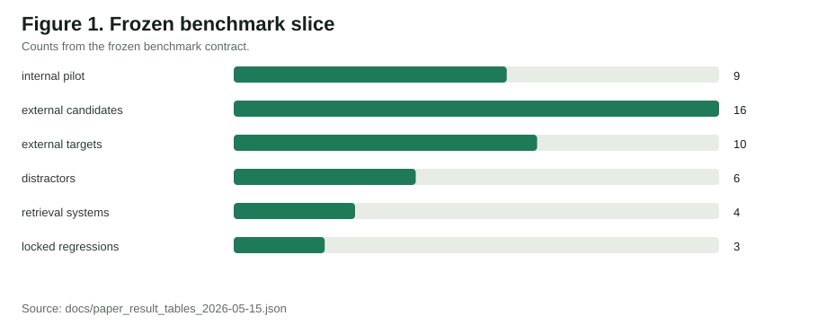
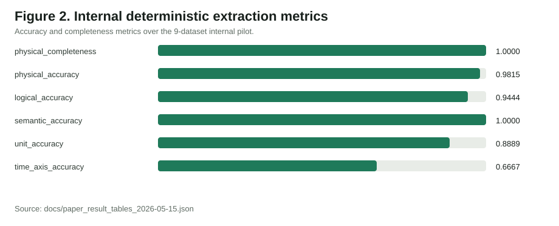
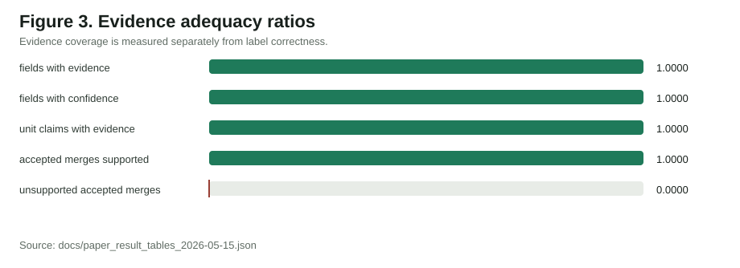
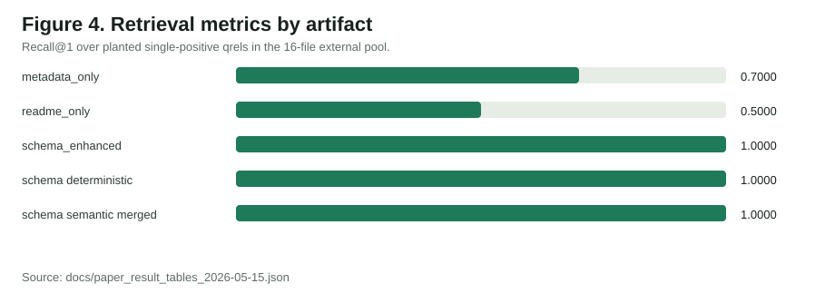
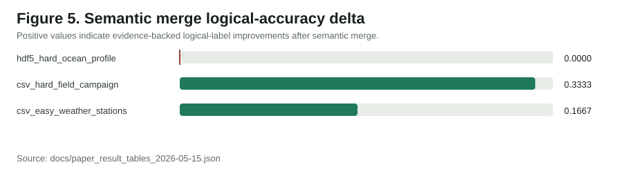

# Paper Figures

These SVG figures are generated from `docs/paper_result_tables_2026-05-15.json` by `python -m high_fidelity_schema_study.build_paper_figures`.

They are paper-facing summaries, not new experiment outputs.

## Figure 1. Frozen benchmark slice

Counts from the frozen benchmark contract.

## Figure 2. Internal deterministic extraction metrics

Accuracy and completeness metrics over the 9-dataset internal pilot.

## Figure 3. Evidence adequacy ratios

Evidence coverage is measured separately from label correctness.

## Figure 4. Retrieval metrics by artifact

Recall@1 over planted single-positive qrels in the 16-file external pool.

## Figure 5. Semantic merge logical-accuracy delta

Positive values indicate evidence-backed logical-label improvements after semantic merge.
