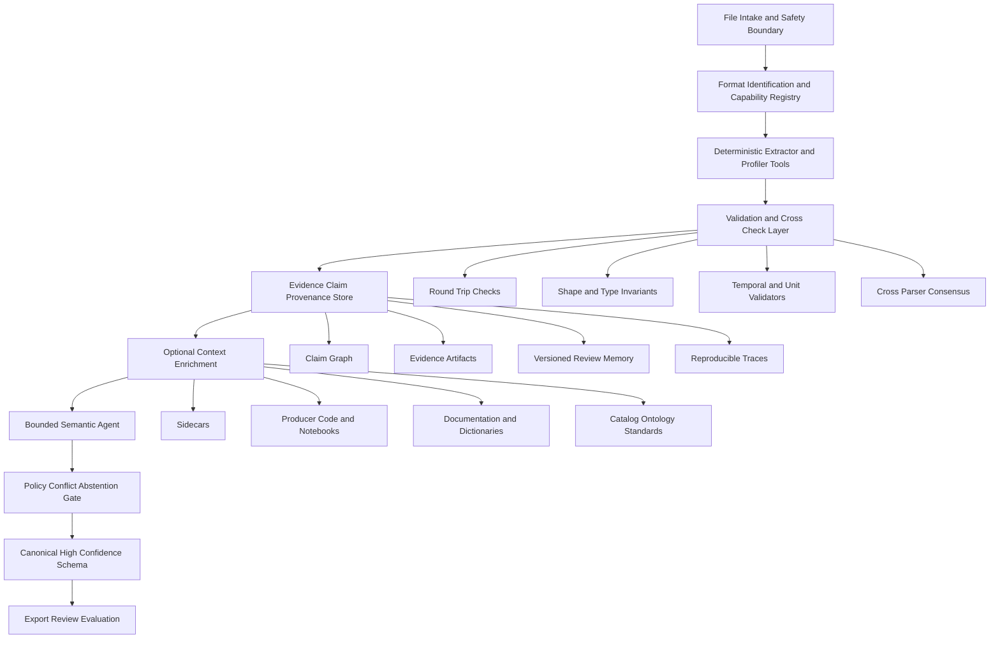

# 高保真模式抽取与主流数据代理架构的深度比较研究

## 执行结论与问题边界

- **最强结论**：这个项目**不应被改造成“自主 LLM-first data agent”**；它更应该进化为一个**agent-ready、deterministic-first 的 schema system**，由格式专用解析器与验证器先建立“物理真相”，再由**受边界约束的 semantic agent**只处理剩余歧义。OpenAI、Databricks、Snowflake 当前最强能力大多建立在**已存在的表、语义模型、治理权限或上下文层**之上，而不是从原始异构文件直接恢复可信 schema。citeturn58view2turn27view1turn28view1turn50view1turn51view0turn61view0
- **应保持不变的核心 thesis**：`deterministic extraction owns canonical physical structure`、`semantic augmentation may enrich but may not invent unsupported fields`、`unknown 优于幻觉`、`every accepted claim should cite evidence`。这些原则不是保守，而是你这个问题域里最重要的工程与科学约束。fileciteturn0file0
- **OpenAI 的最大可迁移启发**不是“让 agent 自由发挥”，而是**把上下文分层**：schema metadata、历史使用、人工注释、代码分析、机构知识、记忆、运行时验证共同形成可检索上下文；尤其重要的是“很多关键含义存在于 pipeline code，而不只是在 schema 里”。这对你的项目意味着：**sidecar / producer code / notebooks / data dictionaries** 应成为**弱证据层**，但绝不能凌驾于文件内的确定性结构证据之上。citeturn58view2turn58view4turn58view8
- **Anthropic 的最大可迁移启发**是：先用**simple composable workflows**，只有在收益明确时才增加 agent autonomy；并且把上下文做成**just-in-time progressive disclosure**，避免一次性把整个世界塞进上下文。对你的项目，这直接支持“**先廉价探测、再按需加深抽取**”以及“大文件不全量载入”的路线。citeturn61view0turn61view1turn20view2
- **Databricks / Snowflake / Google ADK 的价值**主要在**agent infrastructure**，不是 raw schema extraction。它们贡献的是：权限继承、受管运行时、线程/记忆、图式工作流、工具描述、监控、评测、反馈闭环、MCP 连接，而不是从原始 HDF5 / binary / instrument exports 中恢复高可信 field-level schema。citeturn27view0turn27view1turn27view2turn28view6turn31view2turn50view1turn51view4turn51view5
- **最佳未来形态**不是“agent orchestrates everything”，而是**hybrid workflow/agent system with verification gates**：主干仍是固定 deterministic pipeline；只有在格式选择、弱证据补充、跨文件对齐、语义消歧这些**高模糊、低破坏性**分支上，才允许 bounded agent 参与。citeturn61view0turn61view1turn18view0turn59view1
- **下一阶段最该先做的不是更多 autonomy，而是更多 standards support**：Parquet/Arrow、NetCDF+CF、Zarr、JSON/XML、Avro/Protobuf、FITS、GRIB、UCUM/QUDT、PROV/RO-Crate/Croissant 等 deterministic 基础设施应先补齐，否则 agent 只能在 parser 缺席时用推断来掩盖基础能力空洞。citeturn62search3turn62search0turn57search5turn62search4
- **你当前项目最明确的现实短板**不是“semantic hallucination”，因为你已经把它压住了；而是**format coverage、temporal semantics、capability registry、progressive extraction、calibrated confidence、cross-file context graph**。尤其是你自己给出的 frozen slice 中，`time-axis accuracy = 0.6667`，这已经精确指出了下一轮最值得投入的 deterministic 缺口。fileciteturn0file0
- **评估体系必须分层**：raw-file physical extraction、logical inference、semantic enrichment、evidence adequacy、provenance completeness、abstention correctness、robustness、scalability、retrieval utility 要分开测；对 deterministic 部分坚持单次可复现实验，对 nondeterministic 部分再引入 multi-trial 与 `pass^k` 一类可靠性指标。citeturn20view6turn20view7turn58view6turn27view2turn51view2
- **是否应该成为“data agent”**：**不应成为以自主性为中心的数据代理；应成为一个以可审计 schema 为中心、可被 agent 调用的 schema substrate**。换句话说，目标不是“像一个 analyst 一样自由探索”，而是“像一个 forensic-grade schema engine 一样给分析系统提供可信结构真相”。citeturn61view0turn58view2turn50view1

这份问题必须先和“下游数据分析代理”划清边界。你的目标是：从**raw/opaque binary、time-series、HDF5 / NetCDF-like hierarchical scientific files、CSV 以及未来诸如 Parquet、Arrow、JSON、XML、FITS、GRIB、Zarr、instrument exports** 中，恢复**高保真、可审计、可弃权**的 schema；而 OpenAI in-house data agent、Databricks Genie、Snowflake Cortex Agents/Cortex Analyst 这类系统，主要面对的是**已存在的 warehouse tables、semantic views、catalog metadata、historical usage、机构知识与 governed execution**。它们解决的是“如何更好地问数/分析/编排”，不是“如何从原始文件建立可信结构真相”。fileciteturn0file0 citeturn58view2turn58view8turn27view1turn28view1turn50view1turn51view0

因此，判断一个外部系统“领先”与否，不能只看 agent autonomy 或 NL-to-SQL 成绩。对你的问题，真正重要的是：**谁负责 canonical physical truth；谁能保留 unknown；谁能让 claim 和 evidence 可回放；谁能在 parser 不足时安全弃权；谁能支持格式扩展而不污染 scientific validity**。按这个标准看，非 agent 的 parsers、标准与 validators 在核心路径上仍然比大多数数据代理更接近你的目标。citeturn61view0turn62search3turn62search0turn62search4

## 当前项目评估

你当前项目已经抓住了这个研究方向最难也最正确的部分：**把“物理结构”与“语义增益”拆开治理**。从你给出的架构看，当前主干是“format detection → deterministic format-specific extractor → field-level structural evidence → profiling/normalization → evidence-constrained semantic annotation → conservative conflict-aware merge → layered schema + provenance + uncertainty”，而且你已经明确规定 stronger evidence overrides weaker evidence、conflicts remain visible、`unknown` 是合法优先输出。这个设计与现代 agent infrastructure 的最佳实践并不冲突，反而是它们所欠缺的上游 substrate。fileciteturn0file0

项目现有实现也已经具备“论文级可辩护原型”的轮廓：deterministic CSV、HDF5、time-series 抽取器；raw-binary 的高保真 abstention；physical/logical/semantic layered schema；field-level source evidence、confidence、uncertainty reason、claim states；deterministic profiling for missingness、identifier quality、relationship candidates；UCUM-oriented unit normalization；evidence-constrained semantic annotation / merge-back；PROV-like provenance export；gold schemas、benchmark freeze、qrels、reports、tests 与 GUI workbench。最关键的是：你的 frozen slice 显示 deterministic physical completeness 为 `1.0000`，physical accuracy 为 `0.9815`，accepted semantic merges with support 为 `3/3`，unsupported accepted semantic merges 为 `0`。这说明你已经在最容易被 LLM 破坏的地方做对了边界。fileciteturn0file0

真正的弱点也很清楚，而且大多不是 thesis 级错误，而是系统化扩展前必须补的工程空白。第一，**格式覆盖仍窄**，目前还没有把 Parquet/Arrow、NetCDF/CF、Zarr、JSON/XML、FITS、GRIB、Avro/Protobuf 等纳入确定性能力面。第二，**time-axis semantics** 是已量化的最明显缺口。第三，**extractor selection / capability discovery / progressive extraction / large-file handling** 还没有形成一个正式的 registry/contract 层。第四，**context graph 与 reusable review memory** 尚未产品化，所以跨文件 schema family 对齐与后续 agent 调用都还缺少统一 substrate。第五，**confidence 看起来是有意义的，但还不是经过严格 calibration 的 risk estimate**。fileciteturn0file0

结论上，我认为你当前项目最该保护的不是“实现细节”，而是以下四个非协商保证：**physical truth must be parser-owned；weak evidence can enrich but not overwrite strong evidence；unsupported claims must remain visible as unknown/conflicted；every accepted claim must be replayable from evidence/provenance**。这些保证一旦被“方便的 agent 自由度”冲掉，项目就会从“schema extraction science”滑回“plausible metadata generation”。fileciteturn0file0

## 最新系统与标准简报

**OpenAI in-house data agent** 的核心价值不是 raw extraction，而是**多层上下文工程**。OpenAI 明确公开了六层上下文：`Table Usage`、`Human Annotations`、`Codex Enrichment`、`Institutional Knowledge`、`Memory`、`Runtime Context`；其中 `Codex Enrichment` 直接承认**代码层定义能告诉 agent 真实数据含义、粒度、更新频率与排除范围**，而 `Runtime Context` 则允许 agent 在上下文缺失或陈旧时发 live queries 做现实校验。它还把离线聚合后的上下文 embedding 化，经 RAG 在查询时按需检索；评估则不是只比 SQL 字符串，而是同时比较 expected SQL 与结果 dataframe / result equivalence，并在现有 permission model 下做 pass-through access。这给你的项目的真正启示是：**把 sidecar code 和 institutional context 变成“低权重可审计证据层”**，而不是直接把它们写进 canonical schema。citeturn58view2turn58view4turn58view5turn58view6turn58view8turn60view0turn59view0

OpenAI 的 agent primitives 也很适合借鉴，但要借在**接口与治理层**，不是借在“让模型接管真相”。`Responses API` 被 OpenAI定义为建构 agents 的新 primitive，支持 built-in tools、conversation state、function calling、file/web/computer tools；`Agents SDK` 明确有 tools、guardrails、handoffs、human-in-the-loop、sessions、context management、MCP、tracing、sandbox agents 与 memory；`Structured Outputs` 则通过 schema-constrained decoding 把模型输出收束到 developer-supplied JSON Schema。对你的系统而言，这些组件更像**semantic layer / review layer 的 runtime contract**，而不是 physical extraction 的替代品。citeturn60view0turn59view0turn59view1turn60view1

**Anthropic** 公开的最强模式不是某个“Anthropic Data Agent”产品，而是一套清晰的方法论。`Building Effective AI Agents` 明确把 **workflow** 定义为“LLMs and tools orchestrated through predefined code paths”，把 **agent** 定义为“LLMs dynamically direct their own processes and tool usage”，并建议始终先找**最简单可行解**。`Effective context engineering for AI agents` 又进一步强调 **just-in-time retrieval**、**progressive disclosure**、hybrid upfront + runtime context、以及通过 lightweight identifiers 和工具在运行时逐层发现语境。`Writing effective tools for agents—using AI agents` 则把工具接口工程化：工具要少而清楚、命名空间要明确、返回信息要高信号、低级 ID 要尽量隐藏、tool responses 要 token-efficient。再加上 Claude docs 中的 managed agents、persistent event history、sandboxed code execution、context editing 与 memory tool，以及 `Demystifying evals for AI agents` 对 task / trial / grader / transcript / outcome / harness / `pass^k` 的定义，这一整套组合几乎直接回答了你该如何**把 nondeterminism 限定在 semantic/process 侧，而把 extraction correctness 保留在 deterministic 侧**。citeturn61view0turn61view1turn18view0turn20view2turn20view6turn20view7turn61view3turn61view4turn61view5

**Databricks Genie family** 明确属于“已治理数据上的下游代理”。`Genie Spaces` 是面向域数据的自然语言问答界面，依赖 Unity Catalog 中注册的数据集、example SQL、business semantics、instructions；`Agent mode in Genie Spaces` 会形成 research plan、执行多轮 SQL、hypothesis testing、输出带 citations 的报告，但它使用的仍是**同一份 Genie Space 上下文与同一份治理数据**。`Genie Code` 则更面向开发者，能在 notebooks、SQL editor、Lakeflow Pipelines、dashboards、MLflow 中对 Unity Catalog tables / columns / lineage 做多步工作。Databricks 文档还显示：Genie query 是 read-only，权限、row filters、column masks 都由 Unity Catalog 在每用户层面执行；同时系统提供 testing/monitoring、benchmarking、feedback 回写与 `Inspect` 之类的查询自校正机制。对你的项目最能迁移的不是它的 SQL agent，而是它的**governed execution、feedback loop、tool-specific validation、author-curated context**。citeturn26view1turn27view0turn27view1turn27view2turn28view1turn28view6

**Google** 这条线公开得最充分的是 **Agent Development Kit**，而不是 data-agent 内部细节。ADK 2.0 官方文档已经给出 graph workflows、multi-agent workflows、human input、evaluation、observability、sessions and memory、context compression、MCP、A2A protocol integration、artifacts 与 skills，且明确强调“**weave deterministic code with adaptive AI reasoning**”。这和你的目标天然兼容：把 deterministic extractor / profiler / validator 视作 graph nodes 或 typed tools，而不是由 agent 自己发明中间结构。至于 Google Cloud 在 2025 年公开宣传的 Data Engineering Agent、Data Science Agent、Conversational Analytics Agent 与 Gemini Data Agents APIs，公开报道显示它们更偏向 data engineering / analysis workflows，而不是 raw-file schema inference；截至本研究 cutoff，我能获得的一手公开技术规范仍主要集中在 ADK/agent platform 层，因此下面对 Google data-agent 家族只抽取**基础设施模式**，不反推未公开架构。citeturn31view2turn34news0turn37news0

**Microsoft** 这条线在截至 2026-06-10 的公开材料中，最可验证的也更像是**context grounding + enterprise agent fabric**，而不是独立、细粒度公开文档化的 `Fabric Data Agent`。公开报道把 `Fabric IQ` 描述为 structured business data 的 grounding layer，并把 `Project Rayfin` 描述为建立在 Microsoft Fabric 上的 managed backend path；这说明 Microsoft 的重点也在**agent grounding、管理、observability、lifecycle**，不是从原始异构文件建立 schema。这里我建议把 Microsoft 视作**enterprise context fabric family** 的一例，而不要对某个尚无充分一手技术文档的“Fabric Data Agent”做强断言。citeturn48news0turn48news1

**Snowflake Cortex Analyst / Cortex Agents** 是目前最清楚地把“已有语义层 + governed agent orchestration”组合到一起的厂商之一。`Cortex Analyst` 依赖 semantic model / semantic views，把 business meaning 编码进 lightweight YAML / semantic view 中，并用 verified queries 做持续评估；`Cortex Agents` 则在 Snowflake governed environment 里统一调用 Analyst、Search、code execution、custom tools、agent skills、MCP connectors、web search，并保留 threads、monitoring、feedback、evaluations、versioning 与 role-based access controls。这里的关键点是：**它们非常强，但前提是 semantic model 已经存在，且数据已经进入 Snowflake**。所以它们对你的问题不是替代，而是“下游消费者”：一旦你的系统能高质量吐出 canonical schema，它们就会成为很好的使用方。citeturn50view1turn51view0turn51view2turn51view4turn51view5turn51view6

**非 agent baselines 与标准** 在你的核心路径上仍然更重要。Apache Tika 代表“文件检测与元数据/文本抽取”；CF conventions 代表科学数据尤其是 netCDF/地学数据中的自描述语义约定；W3C PROV 代表 provenance interchange；Croissant 代表 dataset-level metadata packaging。它们都不是自主 agent，但它们各自承担的恰好是你的 agent 不该凭空发明的部分：**格式识别、结构约束、语义约定、出处描述**。如果这些层不先扎实，后续 agent 只会把不确定性包装得更像确定性。citeturn62search4turn62search3turn62search0turn57search5

**关于最新 benchmark family**，结论也必须分清边界。`DABstep`、`DSEval`、`DataSciBench`、`Spider 2.0` 都很值得看，但它们测的是 multi-step data analysis、data science 生命周期、复杂 text-to-SQL workflow 等；这些 benchmark 很适合启发你的**agent layer、tool layer、evaluation harness**，却**不能替代 raw-file schema extraction benchmark**。尤其 `Spider 2.0` 本身就强调真实 enterprise text-to-SQL 需要 schema、metadata、文档、代码库与长上下文支持——这恰恰反向说明：如果上游 schema substrate 不可靠，下游代理再聪明也只是站在流沙上。citeturn55academia0turn55academia2turn56academia0turn56academia2

## 统一比较矩阵

| 系统或架构 | 主要问题 | 输入假设 | 支持数据形态 | 确定性核心 | Agent 角色 | 上下文架构 | 证据模型 | Schema / semantic layer | 验证闭环 | Unknown / conflict | Provenance / audit | Security / governance | Evaluation | Extensibility | 可迁移强项 | 关键局限 |
| --- | --- | --- | --- | --- | --- | --- | --- | --- | --- | --- | --- | --- | --- | --- | --- | --- |
| **当前项目** | Raw-file 高保真 schema extraction | raw files / bytes / HDF5 / CSV / time series | binary, CSV, HDF5, time series | format-specific extractor + profiling + conservative merge | semantic enrichment only, bounded by evidence | layered physical/logical/semantic + provenance + uncertainty | field-level source evidence | layered schema, units, logical roles, claim states | deterministic profiling + merge checks | explicit `unknown`, visible conflicts | PROV-like export, field-level provenance | local extraction, frozen benchmark separation | field accuracy, evidence, retrieval utility | 新格式靠新 extractor | 最接近你的目标 | 格式覆盖、time-axis、registry、graph 尚弱 fileciteturn0file0 |
| **OpenAI in-house data agent** | governed data analysis over internal platform | warehouse tables + metadata + query history + code + docs + memory | tables, docs, code, live warehouse data | warehouse execution, permissions, eval harness | planning, context retrieval, SQL generation, self-correction | six-layer context + offline aggregation + RAG + runtime validation | SQL, results, code-derived context, institutional docs, memory | schema metadata + annotations + code enrichment | live queries + expected SQL/result comparison | can ask clarifying questions; not a schema abstention engine | traces, Evals, memory, pass-through permissions | existing security/access model, MCP entrypoints | golden SQL + result/dataframe comparison | strong for org-scale context layering | code-aware context graph design | assumes structured/governed data already exists citeturn58view2turn58view4turn58view5turn58view6turn58view8turn60view0turn59view0 |
| **Anthropic patterns** | reliable agent construction | tools + docs + files + managed agents or message loop | docs, files, code, tools, search, sandbox | predefined workflows, sandbox, tool contracts | optional autonomy, tool use, evals, long-run context mgmt | just-in-time retrieval, progressive disclosure, context editing, memory | transcripts, tool calls, trials, outcomes | no native raw schema layer; tool/interface centric | multi-trial evals, graders, pass@k/pass^k | recommends simpler workflows first | transcript/trace/harness centric | sandbox isolation, managed agents, approvals | task/trial/grader/outcome/harness | very strong tool design guidance | tool interface discipline + eval design | not a raw schema extractor product citeturn61view0turn61view1turn61view2turn20view2turn61view3turn61view4turn61view5 |
| **Databricks Genie family** | NL analytics / data engineering on Unity Catalog | curated space + governed tables + example SQL + instructions | warehouse tables, local CSV/Excel blend-ins | SQL warehouse, read-only queries, Unity Catalog enforcement | research planning, SQL iteration, code/pipeline assistance | curated space context + instructions + monitoring + feedback | SQL, visualizations, citations, user feedback | metrics/business rules/instructions over catalog metadata | Inspect-style query verification, monitoring, benchmarks | non-deterministic; feedback does not auto-become truth | activity logs, feedback, monitoring | row filters, column masks, per-user permissions | benchmarks, test/monitor | good within lakehouse | governed execution + human-in-the-loop tuning | not raw heterogeneous file schema inference citeturn26view1turn27view0turn27view1turn27view2turn28view1turn28view6 |
| **Google ADK and data-agent family** | agent platform, workflows, collaborative agents; downstream data workflows publicly advertised | models + tools + skills + graph workflows; public reports mention BigQuery-centered data agents | agents, tools, workflows, enterprise services | graph workflows, runtime, sessions/memory, eval/observability | orchestration, routing, multi-agent collaboration | graph workflows + context mgmt + MCP + A2A | traces, events, artifacts, sessions | depends on attached tools/skills, not native file schema layer | evaluation/simulation hooks in framework | supports human input/state, not field-level abstention semantics | runtime logs/traces/events | enterprise deployment/runtime boundary | evaluation + observability built in | high for tool ecosystems | workflow graph substrate for bounded orchestration | public first-party detail on specific data-agent internals is thinner than on ADK itself citeturn31view2turn34news0turn37news0 |
| **Microsoft Fabric / Fabric IQ family** | enterprise grounding, agent management, structured business context | OneLake/Fabric/enterprise context | enterprise data/services | managed platform layers | grounding/orchestration/management | IQ-style context grounding | limited public detail in retrieved material | appears to center on structured enterprise context | insufficient public technical depth for stronger statement | unknown from public evidence | lifecycle/management focus | enterprise governance emphasis | not enough retrieved primary detail | likely high in enterprise platform context | enterprise context fabric pattern | insufficient public evidence to treat as a documented raw-schema system citeturn48news0turn48news1 |
| **Snowflake Cortex Analyst + Agents** | conversational analytics + governed agent platform | semantic model / semantic views + Snowflake data + search indexes | structured + unstructured Snowflake-resident data | semantic views, warehouse execution, roles, threads | plan/use tools/reflect/respond | semantic model + search + threads + skills + MCP | SQL/execution/search/code outputs + feedback | semantic YAML/views, verified queries | evaluations, monitoring, feedback, code sandbox | not designed for raw-file abstention | threads, logs, traces, versioning | role-based access, secure perimeter, isolated sandbox | verified queries + agent evaluations | strong inside Snowflake | semantic-model + governed orchestration fusion | assumes semantic model and ingested data already exist citeturn50view1turn51view0turn51view2turn51view4turn51view5turn51view6 |
| **Metadata context graph family** | lineage / ownership / glossary / trust signals for agents and humans | catalog metadata, lineage, glossary, usage signals | metadata graphs, docs, lineage | graph store / catalog services | retrieval and grounding | queryable context graph | lineage / ownership / glossary / quality nodes | business & governance semantics, not file-grounded structure | catalog-quality checks | conflicts often become governance tasks, not file claims | good for audit/navigation | strong governance potential | depends on upstream metadata quality | high for cross-file alignment | ideal side substrate for your claim/evidence graph | not a substitute for parsers; public product-level detail here was insufficient in this run |
| **Non-agent parser / standard stack** | format detection, schema descriptors, provenance vocabularies | files, containers, standard descriptors | files, scientific containers, metadata packages | parsers, schemas, conventions, validators | none or minimal | explicit standards, not free-form memory | format metadata, spec-backed fields | CF / PROV / Croissant / parser metadata | schema validation and parser checks | usually explicit unknowns by omission | strong when modeled correctly | standards and parser contracts | deterministic benchmarking possible | best path for new formats | raises floor of truthfulness | cannot resolve all semantics alone; still needs bounded enrichment citeturn62search4turn62search3turn62search0turn57search5 |

这张矩阵里最重要的结论只有一句：**几乎所有“领先 data-agent”都把难题放在下游分析与工具编排上，而你的项目要解决的是上游的 truth-establishing extraction**。所以你应该向它们借**上下文工程、工具接口、权限、评测、追踪**，而不是复制它们把“数据已被建模和治理”的前提偷偷带进来。citeturn58view2turn61view0turn27view1turn50view1

## 可迁移模式、应拒绝模式与详细缺口分析

下面的判断标准只有一个：**凡是削弱 determinism、evidence、abstention、replayability 的模式，都该拒绝或强约束；凡是提高 format extensibility、verification、context quality、governance 的模式，都该吸收。**

| 缺口 | 建议 | 应采纳来源 | 是否保持 thesis |
| --- | --- | --- | --- |
| **Format routing and capability discovery** | 建立 **registry-based capability model**：每个 extractor 声明 `supports`, `confidence class`, `streaming ability`, `max file size hint`, `evidence types`, `validation contracts`, `safe-failure modes`。格式选择先由 magic/MIME/container signatures 做 deterministic 路由；只有 signatures 冲突或容器复合时才让 bounded agent 提议次级工具链。 | Anthropic 的 tool ergonomics / namespacing；ADK graph nodes；OpenAI tool primitives。citeturn61view2turn31view2turn59view1 | **是** |
| **Progressive extraction** | 采用 **inspect → shallow parse → selective deep parse → optional full scan** 的四段式。先拿 headers/metadata/shape，再决定是否深入变量、chunk、groups、samples；对大文件支持 sampling + chunked scan，并把“sample/full disagreement”记为 evidence conflict。 | Anthropic just-in-time / progressive disclosure；OpenAI runtime context。citeturn61view1turn58view2 | **是** |
| **Agent-orchestrated deterministic tools** | 让 agent 只在**工具排序与弱证据收集**上工作，不得直接写 canonical physical structure。也就是说：**agent may call extractor; agent may not replace extractor**。固定工作流的部分包括 format detect、physical parse、validator chain、claim promotion。 | Anthropic workflow-first；OpenAI/Snowflake/Databricks tool orchestration。citeturn61view0turn50view1turn27view1 | **是** |
| **Code and sidecar enrichment** | 把 producer code、notebooks、README、data dictionary、sidecar JSON/XML/YAML、pipeline definitions 纳入 **Context Enrichment Layer**，但证据等级低于 file-grounded metadata。建议设计 `evidence_rank = file_internal > parser_derived > standard_mapping > sidecar_doc > code_inference > LLM_semantic_guess`。 | OpenAI Codex Enrichment / Institutional Knowledge。citeturn58view2turn58view8 | **是** |
| **Context graph** | 将 `file`, `field`, `claim`, `evidence`, `validator`, `relationship`, `standard mapping`, `review decision`, `dataset family` 建成**可查询图**。这不是为了炫技，而是为了后续 cross-file alignment、adjudication memory、agent retrieval 与 audit replay。 | OpenAI layered context；metadata context graph family；Snowflake threads/evals 作为下游消费者模式。citeturn58view8turn51view5 | **是** |
| **Tool / extractor interface design** | 统一 extractor API：输入文件引用、输出 `claims + evidence artifacts + validation hooks + cost hints`，同时暴露为内部 registry，可选再映射为 MCP tools。MCP 应是**外部接入协议**，而不是内部 truth model。 | Anthropic MCP/tool design；OpenAI Agents SDK MCP；Snowflake MCP connectors。citeturn18view0turn59view1turn51view4 | **是** |
| **Verification and self-correction** | 优先做 deterministic closed-loop：re-parse consistency、round-trip metadata checks、sample-vs-full agreement、shape invariants、time monotonicity、unit compatibility、cross-parser consensus。自纠错可以有，但必须由 validator 触发，不由 agent 自主“修正真相”。 | Databricks Inspect；OpenAI runtime validation；Snowflake plan/use/reflect loop。citeturn28view1turn58view2turn51view6 | **是** |
| **Confidence calibration and abstention** | 把当前 confidence 从“工程分数”升级为**可校准风险量**。对 deterministic claims 做 exact/near-exact reliability bins；对 nondeterministic semantic claims 引入 coverage–risk curves、ECE、selective prediction。若无法校准，就把值改名为 `support_score`，别叫 calibrated confidence。 | Anthropic 对 agent nondeterminism 的 `pass^k` 思路；项目自身 abstention原则。citeturn61view5 fileciteturn0file0 | **是** |
| **Time-series and temporal semantics** | 专门增设 **Temporal Semantics Profiler**：区分 event time / ingest time / valid time；检测 timezone, calendar, frequency, irregular sampling, interval vs instant, missing periods, multi-axis time；把时间字段候选做 deterministic scoring，再允许语义层只在同分冲突时补充解释。 | 你自己的 frozen gap 已指向 time-axis；Snowflake verified-query style 说明时间逻辑值得单独测。fileciteturn0file0 citeturn51view2 | **是** |
| **Binary and opaque formats** | 设计 **defensible abstention ladder**：signature → container metadata → available parser/plugin → sidecar → partial reverse engineering only if spec-backed → abstain。不要让 LLM 从十六进制片段“猜 schema”。在科学数据里，这类自动猜测尤其容易变成伪知识。 | 项目现有 raw-binary abstention；Anthropic simplest-solution guidance。fileciteturn0file0 citeturn61view0 | **是** |
| **New-format extensibility** | 短期优先级建议：`Parquet/Arrow` → `NetCDF+CF` → `Zarr` → `JSON/XML` → `Avro/Protobuf` → `FITS/GRIB` → instrument-specific exports。原因不是流行度，而是它们最能提升“deterministic schema + units + axes + provenance”的覆盖面。 | standards-first synthesis；CF/PROV/Croissant/Tika as baseline families。citeturn62search3turn62search0turn57search5turn62search4 | **是** |
| **Human review and memory** | reviewer adjudications 应进入**versioned review memory**，但只能作为弱先验，永远不能直接升格为 canonical truth。必须记录 who/when/why/which evidence changed the claim。stale memory 需有 TTL 或 revalidation trigger。 | OpenAI memory; Anthropic memory tool/context editing。citeturn58view4turn20view2 | **是** |
| **Evaluation maturity** | deterministic tracks 继续 single-run exact eval；semantic/agent tracks 则加 multi-trial、trace grading、tool-call audits。不要拿 Spider 2.0 / DABstep / DSEval / DataSciBench 来替代 schema extraction eval，但要借它们的 harness 思想。 | OpenAI eval pipeline；Anthropic eval taxonomy；DABstep / DSEval / DataSciBench / Spider 2.0。citeturn58view6turn20view6turn55academia0turn55academia2turn56academia0turn56academia2 | **是** |
| **Operational concerns** | 需要把 caching、parallelism、dependency isolation、sandboxing、permissions、prompt-injection from files、plugin trust levels 全部显式化。特别是恶意文件内容绝不能直接进入高权工具上下文。 | OpenAI tracing/tools；Anthropic sandbox isolation；Snowflake secure perimeter；Databricks permission enforcement。citeturn60view0turn61view4turn50view1turn28view6 | **是** |

**应该明确拒绝的模式**有三类。第一，**让 LLM 直接生成 canonical schema**，再事后找一些“看起来像证据”的说明文字来补。第二，**把 code/doc/sidecar 的推断结果静默覆盖 parser 事实**。第三，**为了看起来更智能，隐藏 unknown/conflict**。这三种模式在问答产品里常见，但在 scientific schema extraction 里会直接侵蚀可复现性与可证伪性。fileciteturn0file0

**关于 time-axis gap 的更具体修复**，我建议你不要把它当成“再做点 semantic reasoning”问题，而要把它当成**一个新的 deterministic 子系统**。最小可行做法是：对每个候选时间字段计算一组可解释特征——可解析率、单调性、单位/epoch 一致性、与记录索引的相关性、与 missingness 模式的关系、与其他字段的 lead/lag 关系、是否与 known calendar token 匹配、是否出现在 HDF5/NetCDF 标准属性中——再用规则或轻量判别器产生 `time_axis_candidate_score`。agent 只在两个候选分差极小、且外部文档提供了明确解释时介入。这样才能真正把 `0.6667` 的缺口变成可验证工程问题。fileciteturn0file0

**关于 binary/opaque formats**，你的“高保真 abstention”已经比多数 data-agent 更成熟。下一步不是“更大胆猜”，而是把 abstention 变成**分层可解释的 failure artifact**：`unknown_because_no_signature`, `unknown_because_container_unparsed`, `unknown_because_no_spec-backed_plugin`, `unknown_because_conflicting_sidecars`, `unknown_because_sampling_insufficient`。这会显著提升 bench 评测与人工审查效率。fileciteturn0file0

## 下一版本架构提案

我建议的目标架构是：**deterministic services as the spine, bounded semantic agent as the exception handler**。它既不是单纯 pipeline，也不是全局自治 agent；更准确地说，它是一个**workflow-first system with agentic branches**。OpenAI/Anthropic/Google ADK/Snowflake 的证据都共同指向这一点：强系统并不是“模型统治一切”，而是**高质量上下文、清楚工具契约、严格运行时边界、可回放 traces 与分层评测**。citeturn58view2turn60view0turn61view0turn61view1turn31view2turn50view1



**组件职责与信任边界**可以概括为三层。`File Intake + Safety Boundary` 负责 MIME/magic/container detection、sandboxing、dependency isolation、malicious-content quarantine；这里的原则是**文件不可信、插件也不默认可信**。`Deterministic Extractor/Profiler/Validator` 负责所有 canonical physical claims，这一层必须可重复、可测试、可基准冻结。`Context Enrichment + Bounded Semantic Agent` 只允许提出、解释、映射、对齐、补充分层语义，不允许无证据增添 field，也不允许推翻强物理证据。最后 `Policy/Conflict/Abstention Gate` 是唯一把候选 claim 升格为 canonical schema 的关口。citeturn61view2turn61view4turn59view1turn50view1turn28view6

**Claim promotion** 我建议采用四态而不是二态。`unknown` 表示系统没有足够证据；`derived` 表示从 parser, profiler, standards mapping 或 weak context 得到的候选；`supported` 表示已通过 validator 并满足最小证据门槛；`conflicted` 表示存在互相不兼容、且尚未裁决的证据。promotion gate 应该是显式规则：
`unknown -> derived` 需要至少一个 extractor/profile/standard/context 产生候选；
`derived -> supported` 需要通过相应 validator，并附至少一条 evidence artifact；
`derived/supported -> conflicted` 发生于强证据冲突或 sample/full disagreement；
`conflicted -> supported` 只能经 reviewer adjudication 或新的更强证据进入。
这会把“unknown 优先于编造”的原则落到状态机，而不是只写在 README 里。fileciteturn0file0

**插件 / 工具接口** 应该长这样：它先是内部契约，其次才可以映射成 MCP tool。最小字段建议包括：`tool_id`, `version`, `supported_formats`, `capabilities`, `cost_class`, `streaming_mode`, `safety_level`, `returns_claim_types`, `validator_hooks`, `evidence_artifacts`, `failure_modes`, `determinism_class`。这正是 Anthropic 所说的“tool namespacing / ergonomic interfaces / meaningful context / explicit contracts”在你问题域的具体化。citeturn61view2turn18view0turn59view1

```json
{
  "tool_id": "netcdf_cf_extractor",
  "version": "0.1.0",
  "supported_formats": ["application/x-netcdf"],
  "capabilities": ["enumerate_fields", "decode_time", "extract_units", "read_dimensions"],
  "determinism_class": "strict",
  "cost_class": "medium",
  "streaming_mode": "chunked",
  "safety_level": "read_only_sandbox",
  "returns_claim_types": ["physical", "logical", "semantic_candidate"],
  "validator_hooks": ["shape_check", "cf_time_check", "unit_compatibility_check"],
  "evidence_artifacts": ["attribute_snapshot", "dimension_map", "sample_values"],
  "failure_modes": ["unknown_no_cf_metadata", "conflicted_time_units", "unsupported_compression"]
}
```

**Canonical schema envelope** 则不该再只是“字段列表 + 描述”，而应是一份可审计 claim ledger。最小结构建议包括：`schema_id`, `source_files`, `format_decision`, `file_provenance`, `claims[]`, `relationships[]`, `review_history[]`, `export_views[]`。其中每个 claim 至少要包含：`claim_id`, `path`, `layer`, `subject`, `predicate`, `value`, `state`, `support_score`, `calibration_band`, `evidence_refs[]`, `validator_refs[]`, `conflicts[]`, `derived_from[]`, `standard_mappings[]`, `timestamp`, `producer_tool_version`。这实际上把你现有的 layered schema + provenance export 向图化、版本化迈进一步。fileciteturn0file0 citeturn62search0

```json
{
  "schema_id": "schema:dataset_x:v2",
  "source_files": ["file:a.h5", "file:b.nc"],
  "format_decision": {"type": "netcdf", "state": "supported"},
  "claims": [
    {
      "claim_id": "c1",
      "path": "/group/temp",
      "layer": "physical",
      "predicate": "dtype",
      "value": "float32",
      "state": "supported",
      "support_score": 0.99,
      "calibration_band": "high",
      "evidence_refs": ["ev12", "ev19"],
      "validator_refs": ["val3"],
      "conflicts": [],
      "derived_from": ["netcdf_cf_extractor@0.1.0"],
      "standard_mappings": ["CF:standard_name=air_temperature"]
    }
  ],
  "relationships": [],
  "review_history": [],
  "export_views": ["canonical", "physical_only", "review_queue"]
}
```

**Failure and abstention paths** 必须也是一等公民。一个好的失败产物不是空白，而是：`best-effort format judgment`、`which extractor was attempted`、`what evidence was missing`、`which validators could not run`、`why claim stayed unknown`。这样 GUI、benchmark harness、human reviewer、future agent 都能继续工作，而不是被一个 silent failure 中断。fileciteturn0file0

## 优先路线图、仓库改动与评估重构

**优先路线图**我按四个 horizon 给出。优先级依据你给的公式做了实质排序：`fidelity gain + evidence/auditability gain + extensibility gain - implementation risk - scientific validity risk`。

| Horizon | 问题 | 来源系统/研究 | 具体改动 | 可能影响模块 | 预期收益 | 风险/代价 | 工作量 | 验证实验 | 成功指标 | 改 thesis 吗 |
| --- | --- | --- | --- | --- | --- | --- | --- | --- | --- | --- |
| **A** | extractor 选择与失败不透明 | Anthropic tools, ADK workflows | 建 capability registry + safe failure taxonomy | `extractors/base.py`, `README.md`, `docs/target_schema.md` | 提升可扩展性与可审计失败 | 设计接口时需克制 | 小 | 人工构造 unsupported format suite | unsupported formats 的 failure artifact 完整率 | 否 |
| **A** | time-axis gap | 项目 frozen results + verified-eval thinking | 新建 `temporal_semantics.py`，先 rule-based 再 profile-based | `timeseries_profiler.py`, `deterministic_profile.py`, `docs/evaluation_plan.md` | 直接补最大可量化缺口 | temporal edge cases 很多 | 中 | 新增 timezone/irregular/interval gold cases | time-axis accuracy、abstention precision | 否 |
| **A** | confidence 名称与含义混淆 | Anthropic eval reliability | 将 `confidence` 区分为 `support_score` 与 `calibration_band` | `docs/schema_claim_model.md`, serializers | 降低 overclaim 风险 | 需要迁移现有字段 | 小 | reliability diagram on semantic layer | ECE 或 coverage-risk 改善 | 否 |
| **A** | unknown 解释不够结构化 | 项目 abstention原则 | 标准化 `unknown_reason` 枚举 | `schema_claim_model`, GUI, reports | 更利于 review 与 benchmark | 几乎无 | 小 | reviewer agreement study | unknown reason 覆盖率/一致率 | 否 |
| **B** | code/sidecar 未纳入证据层 | OpenAI Codex Enrichment | 新建 sidecar/code enrichment readers，作为弱证据层 | `semantic_layer.py`, `semantic_annotate.py`, new `context_enrichment.py` | 提升 logical/semantic recall | 易越权到猜测 | 中 | ablation: with vs without weak context | logical/semantic accuracy 提升且 unsupported merge 仍为 0 | 否 |
| **B** | 缺少 cross-file substrate | context graph family | 建 claim/evidence/provenance graph store | new `claim_graph.py`, `build_provenance_manifest.py`, GUI | 改善跨文件对齐与回放 | 数据模型复杂 | 中 | dataset family alignment benchmark | relation F1, review time, trace replay success | 否 |
| **B** | progressive extraction 缺席 | Anthropic JIT context | inspect/shallow/deep/full 四段抽取 | extractors + profiler pipeline | 大文件成本下降，鲁棒性提高 | 更多状态管理 | 中 | large-file benchmark | latency、peak memory、agreement rate | 否 |
| **B** | eval 混层 | OpenAI/Anthropic evals | 把评测拆成 physical / logical / semantic / evidence / provenance / abstention / scalability | `evaluate_internal_baseline.py`, `evaluate_semantic_merge.py`, `docs/evaluation_plan.md` | 结论更可信 | 表格与脚本变复杂 | 中 | frozen + new tracks | 每条结论有独立 metric | 否 |
| **C** | 新格式支持 | standards-first synthesis | 先做 Parquet/Arrow，再做 NetCDF+CF, Zarr, JSON/XML | new extractors, registry, docs | 扩大论文与系统外延 | parser 依赖增加 | 大 | cross-format benchmark pack | format coverage、physical accuracy | 否 |
| **C** | tool boundary 不清 | OpenAI/Anthropic/Snowflake | 内部 typed tool contracts，可选导出为 MCP | extractors, orchestration, docs | future agent-ready | 内外接口双维护 | 中 | MCP wrapper conformance tests | tool contract pass rate | 否 |
| **C** | 安全与运行时隔离 | Anthropic/Snowflake | sandboxed parsing workers + dependency isolation | extraction runtime, CI | 降 prompt injection / parser risk | 工程重 | 大 | malicious file corpora | isolation policy violations = 0 | 否 |
| **D** | calibrated semantic agent | Structured outputs + selective risk | bounded semantic agent 只出 schema-constrained candidate claims | `semantic_annotate.py`, new agent runtime | 提升 recall 且保边界 | 评测难 | 大 | multi-trial semantic evaluation | unsupported accepted merges 维持 0 | **不改 thesis，只扩边** |
| **D** | active human adjudication memory | OpenAI memory + review surfaces | versioned review memory with TTL/revalidation | GUI, claim graph, provenance | reviewer productivity 上升 | stale memory 风险 | 中 | replay-on-new-data study | memory reuse precision | 否 |
| **D** | conceptual schema induction across dataset families | original synthesis + metadata graph | 在 supported claims 之上做 cross-file concept induction | graph layer, evaluation | 高级能力 | 最容易 overclaim | 大 | family-level benchmark | abstention-aware concept F1 | **边缘扩展** |

**Top 10 concrete repo changes** 我建议按“最小但真正有用”的原则这么落：

| 排名 | 最小可实施改动 | 可能文件 |
| --- | --- | --- |
| 1 | 引入 `ExtractorCapability` dataclass 与 registry loader；所有 extractor 注册 `supports / determinism / failure_modes` | `extractors/base.py`, `extractors/__init__.py` |
| 2 | 新建 `unknown_reason` 与 `conflict_reason` 枚举，并写入 claim model | `docs/schema_claim_model.md`, serializers |
| 3 | 新建 `temporal_semantics.py`，从现有 time-series profiler 中拆出独立时序语义判定 | `extractors/timeseries_profiler.py`, new file |
| 4 | 在 physical claim 上加入 `validator_refs[]` 与 `derived_from[]` | `docs/target_schema.md`, export code |
| 5 | 将 `confidence` 重命名为 `support_score`，新增 `calibration_band` 占位 | `schema model`, GUI, reports |
| 6 | 新建 `context_enrichment.py` 读取 sidecar/README/notebook 摘要，但只输出 `semantic_candidate` | `semantic_layer.py`, `semantic_annotate.py` |
| 7 | 在 provenance manifest 中加入 tool version、file hash、sample/full mode | `build_provenance_manifest.py` |
| 8 | 引入 progressive extraction modes：`inspect`, `shallow`, `deep`, `full` | `extractors/csv_extractor.py`, `extractors/hdf5_extractor.py` |
| 9 | 把评测脚本拆分为多 track 输出，生成 per-layer scorecards | `evaluate_internal_baseline.py`, `evaluate_semantic_merge.py`, `docs/paper_result_tables...` |
| 10 | GUI 新增 review queue：只显示 `unknown/conflicted/low-support` claims | `gui_demo/` |

**评估重构** 我建议最少拆成八条轨道。`Physical extraction` 测 field existence、dtype、shape、nesting、encoding、nullability。`Logical inference` 测 identifier、time axis、coordinate、measurement、relationship candidates。`Semantic enrichment` 测 semantic type、descriptions、units、domain meaning，但要求显式证据。`Evidence adequacy` 测 accepted claim 是否真有足够支撑。`Provenance` 测 claim replay completeness。`Abstention` 测 unknown/conflicted 的 precision-recall。`Robustness` 测 malformed files、poisoned sidecars、huge files、partial corruption。`End-to-end utility` 测 schema-enhanced retrieval 或 downstream usability，但要明确其只是 bounded utility，不是 extraction truth 本身。对 deterministic tracks，单次 exact eval 即可；对 semantic agent tracks，再引入 multi-trial，并用 `pass^k` 或至少 variance-aware reporting 衡量稳定性。citeturn20view6turn61view5turn58view6turn55academia0turn55academia2turn56academia0turn56academia2

**关于 benchmark 选型**，`DABstep`、`DSEval`、`DataSciBench`、`Spider 2.0` 值得作为“agent layer 旁证 benchmark”，但不能拿来证明 raw-file schema extraction。它们可以帮助你评测：bounded semantic agent 能否正确使用工具、读取 context、调用 validators、稳定输出结构化 candidate claims；但 physical parser 正确性、unknown correctness、provenance completeness 仍然必须有你自己的 benchmark family。citeturn55academia0turn55academia2turn56academia0turn56academia2

## 风险、来源附录与判断账本

**研究风险与开放问题** 有五个最值得警惕。其一，**semantic improvement 很容易被误读成 schema truth improvement**；所以未来任何“agent 带来提升”的结论，都必须分层报告。其二，**弱证据注入可能把 recall 提高，同时把 unsupported claim 也带进来**；因此你应继续把 “unsupported accepted semantic merges = 0” 当作红线。其三，**review memory 会逐渐变成隐性先验**，如果没有 TTL 和 revalidation，会把历史错误固化。其四，**跨文件 conceptual schema induction** 很有吸引力，但 scientific validity 风险也最高。其五，**公开 benchmark 很容易把系统往下游 text-to-SQL/data-analysis 目标拉偏**，从而稀释你的核心问题。fileciteturn0file0 citeturn55academia0turn55academia2turn56academia0turn56academia2

**开放问题 / limitations**：对 Google 的 data-agent 具体产品族、Microsoft Fabric Data Agent、以及 DataHub Agent Context Kit，我在本次研究中能拿到的公开、可核验技术细节明显少于 OpenAI、Anthropic、Databricks 与 Snowflake。因此我只提炼其**可验证的基础设施模式**，刻意避免对未公开内部架构做“补完式推断”。这一保守处理本身符合本报告所主张的 `unknown over invention`。citeturn31view2turn48news0turn48news1

**来源附录** 仅列本报告最负载的核心来源；访问日期统一为 **2026-06-10**。

| 标题 | 机构/作者 | 日期 | 类型 | 网址 |
| --- | --- | --- | --- | --- |
| Inside OpenAI’s in-house data agent | OpenAI | 2026-01-29 | 官方 engineering post | `https://openai.com/index/inside-our-in-house-data-agent/` |
| New tools for building agents | OpenAI | 2025-03-11 | 官方产品公告 | `https://openai.com/index/new-tools-for-building-agents/` |
| Responses API Reference | OpenAI | 文档页 | 官方 API docs | `https://platform.openai.com/docs/api-reference/responses` |
| OpenAI Agents SDK | OpenAI | 文档页 | 官方 SDK docs | `https://openai.github.io/openai-agents-python/` |
| Introducing Structured Outputs in the API | OpenAI | 2024-08-06 | 官方公告 | `https://openai.com/index/introducing-structured-outputs-in-the-api/` |
| Building Effective AI Agents | Anthropic | 2024-12-19 | 官方 engineering post | `https://www.anthropic.com/engineering/building-effective-agents` |
| Effective context engineering for AI agents | Anthropic | 2025-09-29 | 官方 engineering post | `https://www.anthropic.com/engineering/effective-context-engineering-for-ai-agents` |
| Writing effective tools for agents — with agents | Anthropic | 2025-09-11 | 官方 engineering post | `https://www.anthropic.com/engineering/writing-tools-for-agents` |
| Demystifying evals for AI agents | Anthropic | 2026-01-09 | 官方 engineering post | `https://www.anthropic.com/engineering/demystifying-evals-for-ai-agents` |
| Managing context on the Claude Developer Platform | Anthropic / Claude | 2025-09-29 | 官方产品公告 | `https://claude.com/blog/context-management` |
| Code execution tool | Anthropic / Claude | 文档页 | 官方 API docs | `https://platform.claude.com/docs/en/agents-and-tools/tool-use/code-execution-tool` |
| Genie Spaces | Databricks | 2026-06-09 更新 | 官方 docs | `https://docs.databricks.com/aws/en/genie` |
| Agent mode in Genie Spaces | Databricks | 2026-06-09 更新 | 官方 docs | `https://docs.databricks.com/aws/en/genie/agent-mode` |
| Genie Code | Databricks | 2026-06-09 更新 | 官方 docs | `https://docs.databricks.com/aws/en/genie-code/` |
| Test and monitor a Genie Space | Databricks | 2026-06-09 更新 | 官方 docs | `https://docs.databricks.com/aws/en/genie/monitor` |
| Databricks AI assistive features trust and safety | Databricks | 文档页 | 官方 docs | `https://docs.databricks.com/aws/en/databricks-ai/databricks-ai-trust` |
| Agent Development Kit (ADK) | Google | 2026 文档页 | 官方 docs | `https://adk.dev/` |
| Cortex Agents | Snowflake | 文档页 | 官方 docs | `https://docs.snowflake.com/en/user-guide/snowflake-cortex/cortex-agents` |
| Cortex Analyst | Snowflake | 文档页 | 官方 docs | `https://docs.snowflake.com/en/user-guide/snowflake-cortex/cortex-analyst` |
| DABstep: Data Agent Benchmark for Multi-step Reasoning | Egg et al. | 2025-06-30 | arXiv benchmark paper | `https://arxiv.org/abs/2506.23719` |
| Benchmarking Data Science Agents | Zhang et al. | 2024-02-27 | arXiv benchmark paper | `https://arxiv.org/abs/2402.17168` |
| DataSciBench: An LLM Agent Benchmark for Data Science | Zhang et al. | 2025-02-19 | arXiv benchmark paper | `https://arxiv.org/abs/2502.13897` |
| Spider 2.0: Evaluating Language Models on Real-World Enterprise Text-to-SQL Workflows | Lei et al. | 2024-11-12 | arXiv benchmark paper | `https://arxiv.org/abs/2411.07763` |
| Climate and Forecast Metadata Conventions | CF community | 持续维护 | 标准/约定概览 | `https://cfconventions.org/` |
| PROV-Overview | W3C | Recommendation | 标准 | `https://www.w3.org/TR/prov-overview/` |
| Apache Tika | Apache Software Foundation | 持续维护 | 解析/检测框架 | `https://tika.apache.org/` |
| Croissant | MLCommons Working Group | 2024 | 元数据规范 | `https://docs.mlcommons.org/croissant/` |

**Fact / Inference / Recommendation ledger**：

| 主要陈述 | 标签 | 依据 |
| --- | --- | --- |
| OpenAI in-house data agent 公开了六层上下文，并包含 Codex enrichment、institutional knowledge、memory、runtime context | **verified fact** | citeturn58view2turn58view4turn58view8 |
| Anthropic 明确区分 workflow 与 agent，并建议先做最简单可行系统 | **verified fact** | citeturn61view0 |
| Databricks/Snowflake 的核心前提是已治理数据、catalog 或 semantic model，而不是 raw bytes | **verified fact** | citeturn27view1turn28view1turn50view1turn51view0 |
| 你当前系统的 deterministic-first thesis 与 agent infrastructure 并不冲突，反而应作为其上游 substrate | **reasoned inference** | 基于项目架构与上游/下游边界比较。fileciteturn0file0 citeturn58view2turn61view0turn50view1 |
| 项目最明显的已量化缺口是 time-axis semantics | **verified fact** | fileciteturn0file0 |
| 最佳未来架构是 deterministic pipeline + bounded semantic agent + verification gates | **recommendation** | 本报告综合建议，受 OpenAI/Anthropic/Snowflake/Databricks 模式启发。citeturn58view2turn61view0turn61view1turn50view1 |
| code/sidecar 应进入系统，但只能作为低于 file-grounded evidence 的弱证据层 | **recommendation** | OpenAI Codex enrichment 启发 + 项目 non-negotiable goal。citeturn58view2turn58view8 fileciteturn0file0 |
| MCP 适合做外部 tool exposure，不适合替代内部 canonical claim model | **reasoned inference** | 基于 OpenAI/Anthropic/Snowflake 的 tool/MCP 用法综合推断。citeturn59view1turn18view0turn51view4 |
| DABstep / DSEval / DataSciBench / Spider 2.0 不能替代 schema extraction benchmark | **reasoned inference** | 它们的任务定义集中在 data analysis、data science、text-to-SQL。citeturn55academia0turn55academia2turn56academia0turn56academia2 |
| 项目不应“成为 data agent”，而应“成为 data agents 可调用的 schema substrate” | **recommendation** | 本报告核心结论。citeturn61view0turn58view2turn50view1 |
| 截至本研究 cutoff，Microsoft Fabric Data Agent 与 DataHub Agent Context Kit 的一手公开细节不足以支撑更强断言 | **unknown / insufficient public evidence** | 本次检索可获得材料有限；报告因而保守处理。citeturn48news0turn48news1turn31view2 |

最终判断可以压缩成一句话：

**这个项目最强的未来形态，不是一个更自由的 data agent，而是一套更强、可扩展、可验证、可被 agent 调用的 deterministic-first schema extraction substrate。** 只要你继续把 parser、validator、evidence、provenance 和 abstention 放在真相链条的前面，agent 会成为放大器；一旦把它们放到后面，agent 就会变成污染源。 fileciteturn0file0 citeturn58view2turn61view0turn50view1